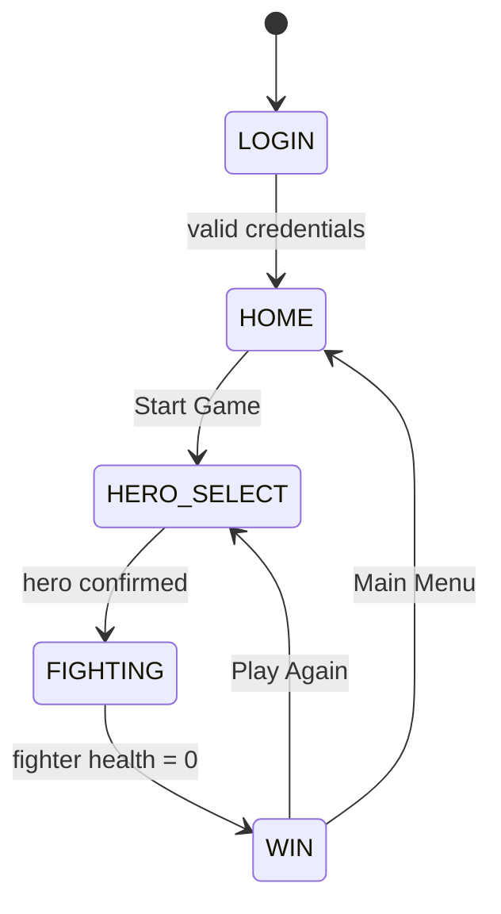

# Design Document: Filipino Heroes Pixel Fighting Game

## Overview

A browser-based 2D pixel art fighting game built with vanilla HTML5 Canvas and JavaScript. No build tools, no frameworks — just plain `.js` files loaded by HTML pages. The game runs entirely client-side. Navigation between screens is done by loading separate HTML pages (or swapping canvas content from a single HTML shell). We will use a **single-page shell** approach: one `index.html` with a canvas and multiple JS modules, where each "screen" is a state that the GameLoop renders differently. This avoids multi-page navigation complexity while keeping the code modular.

## Architecture

```
index.html          ← shell: canvas + script tags
js/
  main.js           ← entry point, bootstraps the GameLoop
  game.js           ← GameStateMachine, top-level orchestrator
  input.js          ← InputHandler (keyboard events)
  states/
    loginState.js   ← LOGIN screen (DOM form overlay)
    homeState.js    ← HOME screen
    heroSelectState.js ← HERO_SELECT screen
    fightState.js   ← FIGHTING screen (game loop core)
    winState.js     ← WIN screen
  fighters/
    fighter.js      ← Fighter base class
    lapuLapu.js     ← Lapu-Lapu stats and hitboxes
    pacquiao.js     ← Manny Pacquiao stats and hitboxes
  ai.js             ← AI controller
  physics.js        ← movement, gravity, collision helpers
  renderer.js       ← canvas draw helpers (sprites, health bars, UI)
  assets.js         ← sprite definitions (pixel art drawn via canvas API)
assets/
  (optional PNG sprites if hand-drawn; otherwise procedural pixel art in code)
```

### State Machine Diagram



## Components and Interfaces

### GameStateMachine (`game.js`)

Holds the current state and delegates `update(dt)` and `render(ctx)` calls to the active state.

```js
// State identifiers
const States = { LOGIN, HOME, HERO_SELECT, FIGHTING, WIN }

class GameStateMachine {
  constructor(canvas)
  transition(newState, payload)   // switches active state, passes optional data
  update(deltaTime)               // calls activeState.update(dt)
  render(ctx)                     // calls activeState.render(ctx)
}
```

Valid transitions:
- LOGIN → HOME
- HOME → HERO_SELECT
- HERO_SELECT → FIGHTING
- FIGHTING → WIN
- WIN → HERO_SELECT
- WIN → HOME

Any other transition logs an error and stays in the current state (Requirement 12.3).

### InputHandler (`input.js`)

```js
class InputHandler {
  constructor()
  isDown(key)       // returns true while key is held
  wasPressed(key)   // returns true on the frame the key was first pressed
  update()          // clears single-frame press state
}
// Key constants: LEFT, RIGHT, UP, JUMP, LIGHT_ATTACK, HEAVY_ATTACK
```

Listens to `keydown` / `keyup` on `window`. Handles both arrow key and WASD variants.

### Fighter (`fighters/fighter.js`)

```js
class Fighter {
  // Identity
  name            // string
  // Position & Physics
  x, y            // canvas position (top-left of sprite)
  vx, vy          // velocity
  width, height   // sprite dimensions
  facingRight     // boolean
  onGround        // boolean
  // Stats
  maxHealth       // number (100)
  health          // number [0, maxHealth]
  // Combat
  state           // AnimationState: 'idle'|'walk'|'attack_light'|'attack_heavy'|'hurt'|'dead'
  attackActive    // boolean — true during the active hit window of an attack
  attackType      // 'light' | 'heavy' | null
  attackCooldown  // frames remaining before next attack allowed
  lastAttackDamageDealt  // boolean — prevents multi-hit (Req 8.5)
  // Methods
  getHitBox()           // { x, y, w, h } — body collision box
  getAttackHitBox()     // { x, y, w, h } | null — active attack box
  applyDamage(amount)   // subtracts from health, clamps to 0, sets hurt state
  update(dt, input)     // advance physics, animation, cooldowns
  render(ctx)           // draw sprite + debug hitbox (dev mode)
}
```

### LapuLapu / Pacquiao (`fighters/lapuLapu.js`, `fighters/pacquiao.js`)

Subclasses of `Fighter` that override:
- `lightDamage`, `heavyDamage`
- `lightRange`, `heavyRange`
- `lightDuration` (frames), `heavyDuration` (frames)
- `renderSprite(ctx)` — pixel art drawing

| Hero | HP | Light DMG | Heavy DMG | Light Range | Heavy Range | Light Duration |
|------|----|-----------|-----------|-------------|-------------|----------------|
| Lapu-Lapu | 100 | 8 | 18 | 80px | 100px | 18 frames |
| Manny Pacquiao | 100 | 6 | 15 | 70px | 80px | 12 frames (~300ms @60fps) |

### AIController (`ai.js`)

```js
class AIController {
  constructor(aiFighter, playerFighter)
  update(dt)   // decides move/attack actions and applies them to aiFighter
}
```

AI decision loop (runs every `actionInterval` ms, randomized 400–900ms):
1. If dead → do nothing.
2. If within attack range → randomly pick light or heavy attack (60/40 split).
3. Else → move toward player.

### Physics helpers (`physics.js`)

```js
applyGravity(fighter, dt)          // vy += GRAVITY * dt; clamp to ground
moveHorizontal(fighter, dx)        // update x, keep within canvas bounds
resolveWallCollision(fighter, canvasWidth)
```

Ground Y is fixed at `canvasHeight - groundHeight - fighter.height`.

### Renderer (`renderer.js`)

```js
drawBackground(ctx)
drawHealthBars(ctx, p1Fighter, p2Fighter)
drawFighter(ctx, fighter)
drawHitBox(ctx, box)              // debug only
drawText(ctx, text, x, y, style)
```

Canvas is configured once:
```js
ctx.imageSmoothingEnabled = false;   // nearest-neighbor (Req 11.2, 11.3)
```

## Data Models

### HitBox

```js
// { x: number, y: number, w: number, h: number }
// All values in canvas pixels.
```

### AnimationState

```
'idle' | 'walk' | 'attack_light' | 'attack_heavy' | 'hurt' | 'dead'
```

### GamePayload (passed during state transitions)

```js
// HERO_SELECT → FIGHTING
{ playerHero: 'lapulapu' | 'pacquiao', aiHero: 'lapulapu' | 'pacquiao' }

// FIGHTING → WIN
{ winner: 'player' | 'ai' }
```

### SessionStorage Schema

```
Key: "fhf_username"   Value: string (the player's display name)
```

## Correctness Properties

*A property is a characteristic or behavior that should hold true across all valid executions of a system — essentially, a formal statement about what the system should do. Properties serve as the bridge between human-readable specifications and machine-verifiable correctness guarantees.*

### Property 1: Health damage arithmetic and clamping

*For any* Fighter with current health H (0 ≤ H ≤ 100) and any incoming damage D ≥ 0:
- After `applyDamage(D)`, the Fighter's `health` must equal `Math.max(0, H - D)` — exactly H − D when D ≤ H, and exactly 0 when D > H.
- After any sequence of `applyDamage` calls, `health` must always be ≥ 0.

**Validates: Requirements 8.2, 8.3**

---

### Property 2: Attack damage matches declared hero stats

*For any* Fighter (Lapu-Lapu or Manny Pacquiao), any attack type (light or heavy), and any positions where the attacker's `getAttackHitBox()` overlaps the defender's `getHitBox()`, the damage applied to the defender's health must equal exactly the hero's declared damage constant for that attack type (8 or 18 for Lapu-Lapu; 6 or 15 for Manny Pacquiao).

**Validates: Requirements 6.2, 6.3, 7.2, 7.3, 8.1**

---

### Property 3: No multi-hit per attack swing

*For any* attack instance, regardless of how many consecutive frames the attacker's `getAttackHitBox()` overlaps the defender's `getHitBox()`, the total damage applied to the defender during that single attack instance must equal the declared single-hit damage — not a multiple of it.

**Validates: Requirements 8.5**

---

### Property 4: Attack hitbox respects declared range for all heroes

*For any* Fighter (either hero), any attack type, and any canvas x position and facing direction, the farthest edge of `getAttackHitBox()` from the Fighter's horizontal center must be ≤ the hero's declared range constant for that attack type (Lapu-Lapu: 80px light / 100px heavy; Pacquiao: 70px light / 80px heavy).

**Validates: Requirements 6.4, 6.5, 7.4, 7.5**

---

### Property 5: Game state machine integrity

*For any* sequence of `transition(newState)` calls — mixing valid and invalid transitions in any order — the GameStateMachine must:
- Always have exactly one active state that is a member of `{ LOGIN, HOME, HERO_SELECT, FIGHTING, WIN }`
- Never change state in response to an invalid transition (one not in the allowed transition map)

**Validates: Requirements 12.1, 12.3**

---

### Property 6: Health bar rendering is proportional

*For any* health value H in [0, 100] and any maxBarWidth, the computed health bar pixel width must equal `Math.round((H / 100) * maxBarWidth)`, clamped to [0, maxBarWidth].

**Validates: Requirements 4.3**

---

### Property 7: Round ends on the frame health reaches zero

*For any* simulated fight sequence where damage events are applied frame by frame, the transition to WIN state must occur on exactly the frame where a Fighter's health first becomes 0 — not before, and not after.

**Validates: Requirements 10.1**

---

### Property 8: Login rejects all-whitespace credentials

*For any* username or password string composed entirely of whitespace characters (including the empty string), the login validation function must return `false` (invalid), preventing navigation and requiring an error to be shown.

**Validates: Requirements 1.2**

---

### Property 9: Hero assignment invariant on selection

*For any* valid player hero selection from the available hero list, after confirmation:
- The Player Fighter's hero must equal the selected hero.
- The AI Fighter's hero must be a valid hero different from the player's selection.

**Validates: Requirements 3.2, 3.3**

---

### Property 10: Username round-trip through sessionStorage

*For any* non-empty, non-whitespace-only username string submitted at login, reading `sessionStorage.getItem("fhf_username")` after login must return the same username string that was entered.

**Validates: Requirements 1.3, 2.1**

---

## Error Handling

| Scenario | Behavior |
|----------|----------|
| sessionStorage unavailable | LoginPage catches the error, logs a warning, and proceeds with an in-memory username |
| Invalid state transition | `GameStateMachine.transition()` logs `console.error` and stays in current state |
| Missing asset / sprite | Renderer falls back to a colored rectangle with the hero's name text |
| AI fighter health = 0 | AI controller exits update loop immediately; no further actions |
| Both fighters reach 0 simultaneously | Player is declared winner (rare edge case — processed in fight update order: player damage applied first) |

## Testing Strategy

### Dual Testing Approach

Both unit tests and property-based tests are used:
- **Unit tests** validate specific examples, edge cases, and integration points
- **Property tests** validate universal invariants across randomized inputs

For this vanilla JS project we use **[fast-check](https://github.com/dubzzz/fast-check)** for property-based testing and a minimal test harness (no heavy framework needed — a small `test.js` runner with `fast-check` loaded via CDN or npm for the test suite only).

### Property-Based Test Configuration

- Minimum **100 iterations** per property test
- Each test is tagged with its design property number
- Tag format: `// Feature: filipino-heroes-fighter, Property N: <property_text>`

### Property Test Mapping

| Design Property | Test Description |
|----------------|-----------------|
| Property 1 | `fc.integer({ min: 0, max: 200 })` damage sequences never make health go below 0 |
| Property 2 | `fc.integer` health and damage pairs, verify `health - damage` when D ≤ H |
| Property 3 | Simulate N frames of hitbox overlap, verify damage applied exactly once |
| Property 4 | Random facing direction and position, verify attack hitbox edge ≤ declared range |
| Property 5 | Random valid/invalid transition sequences, verify state remains valid |
| Property 6 | Random health values [0..100], verify bar width formula holds |
| Property 7 | Simulated fight with scripted damage events, verify WIN triggered on health=0 frame |
| Property 8 | `fc.string()` filtered to whitespace/empty, verify login rejected |

### Unit Test Coverage

- Login: empty fields rejected, valid fields accepted, username stored in sessionStorage
- Hero select: AI hero defaults to the non-player hero
- Fighter: `applyDamage` clamps to 0, sets `hurt` state, sets `dead` state at 0 HP
- HitBox intersection: axis-aligned rectangle overlap function correctness
- AI: AI does not act when health = 0
- Win condition: both fighters simulated to 0 HP, player wins ties
