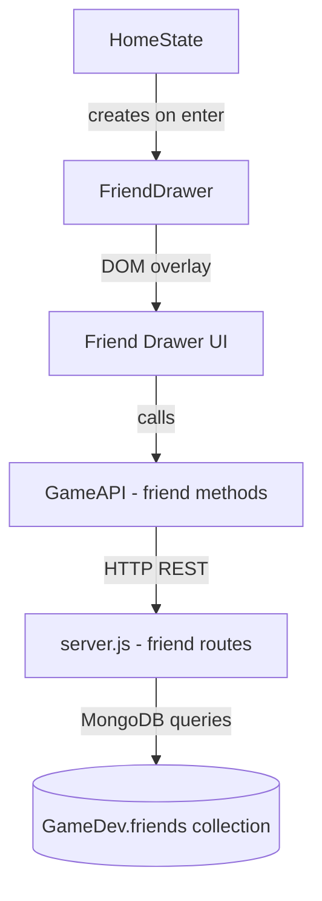

# Design Document: Friend List

## Overview

The friend list feature adds social connectivity to Filipino Heroes Fighter. A slide-out drawer panel on the right side of the screen lets logged-in players manage friends — sending requests, accepting/declining them, and removing existing friends. All data is persisted in a dedicated `friends` MongoDB collection in the existing `GameDev` database.

The implementation follows the existing project conventions:
- Backend: new Express routes added to `server.js`
- Frontend API client: new methods added to `GameAPI` in `js/api.js`
- UI: a new `FriendDrawer` class in `js/friendDrawer.js` injected as a fixed overlay element, mirroring how `HomeState` builds its UI panels
- The drawer is created when the player logs in (`HomeState.enter()`) and destroyed on logout/exit

---

## Architecture



The drawer is a purely DOM-based overlay (same approach as existing modals). It sits outside the canvas and does not interfere with the game loop.

Session identity uses the existing `sessionStorage` keys:
- `fhf_rawusername` — the MongoDB username (used for all API calls)
- `fhf_username` — the in-game display name

---

## Components and Interfaces

### 1. Backend — Friend Routes (`server.js`)

New helper:
```js
function friends() { return db.collection('friends'); }
```

New routes:

| Method | Path | Description |
|--------|------|-------------|
| `GET` | `/api/friends/:username` | Returns `{ friends: [...], requests: [...] }` |
| `POST` | `/api/friends/request` | Send a friend request `{ from, to }` |
| `POST` | `/api/friends/accept` | Accept a request `{ username, requester }` |
| `POST` | `/api/friends/decline` | Decline a request `{ username, requester }` |
| `DELETE` | `/api/friends/remove` | Remove friendship `{ username, friendUsername }` |

### 2. Frontend API Client (`js/api.js`)

New methods added to `GameAPI`:

```js
async getFriends(username)                          // GET /api/friends/:username
async sendFriendRequest(from, to)                   // POST /api/friends/request
async acceptFriendRequest(username, requester)      // POST /api/friends/accept
async declineFriendRequest(username, requester)     // POST /api/friends/decline
async removeFriend(username, friendUsername)        // DELETE /api/friends/remove
```

### 3. Frontend Drawer (`js/friendDrawer.js`)

```js
class FriendDrawer {
  constructor(username)   // username = fhf_rawusername
  open()                  // slide in the drawer
  close()                 // slide out the drawer
  toggle()                // open/close
  destroy()               // remove DOM elements (called on logout)
  _loadAndRender()        // fetch data, rebuild list + requests sections
  _renderFriendEntry(friend)    // returns DOM element for one friend
  _renderRequestEntry(req)      // returns DOM element for one pending request
}
```

The drawer toggle button is injected into the existing `rightBtns` row in `HomeState._buildUI()`.

---

## Data Models

### `friends` collection document

One document per user:

```json
{
  "username": "player1",
  "friends": ["player2", "player3"],
  "pendingIncoming": ["player4"],
  "pendingOutgoing": ["player5"]
}
```

| Field | Type | Description |
|-------|------|-------------|
| `username` | string | Unique — one doc per user |
| `friends` | string[] | Accepted mutual friends (by username) |
| `pendingIncoming` | string[] | Requests received but not yet responded to |
| `pendingOutgoing` | string[] | Requests sent but not yet accepted |

### `GET /api/friends/:username` response shape

```json
{
  "friends": [
    { "username": "player2", "ingamename": "Warrior2", "avatar": "lapu", "overallwins": 5 }
  ],
  "incoming": ["player4"],
  "outgoing": ["player5"]
}
```

The endpoint joins with the `users` collection to enrich friend entries with display data.

---

## Correctness Properties

*A property is a characteristic or behavior that should hold true across all valid executions of a system — essentially, a formal statement about what the system should do. Properties serve as the bridge between human-readable specifications and machine-verifiable correctness guarantees.*

Property 1: Friend relationship is symmetric after acceptance
*For any* two users A and B, if A sends a friend request and B accepts it, then A should appear in B's friend list and B should appear in A's friend list.
**Validates: Requirements 3.2**

Property 2: Declined requests leave no trace
*For any* two users A and B, if A sends a friend request and B declines it, then neither user should appear in the other's friend list, and neither should have a pending entry for the other.
**Validates: Requirements 3.3**

Property 3: Removal is symmetric
*For any* two users who are friends, if one removes the other, then neither user should appear in the other's friend list afterwards.
**Validates: Requirements 4.3**

Property 4: No duplicate friend entries
*For any* user, their friend list and pending request lists should never contain the same username more than once, regardless of how many requests are sent.
**Validates: Requirements 2.5**

Property 5: Self-friending is rejected
*For any* username, sending a friend request to oneself should always result in an error response and the friend document should remain unchanged.
**Validates: Requirements 2.4**

Property 6: Empty/whitespace requests are rejected
*For any* string composed entirely of whitespace characters, submitting it as a friend request target should be rejected before reaching the database.
**Validates: Requirements 2.6**

Property 7: GET friends response enrichment
*For any* user with friends, every entry in the `friends` array of the GET response should include `ingamename`, `avatar`, and `overallwins` fields sourced from the `users` collection.
**Validates: Requirements 1.3**

---

## Error Handling

| Scenario | HTTP Status | Response |
|----------|-------------|----------|
| Missing `username` field in request body | 400 | `{ error: "username required" }` |
| Target user not found | 404 | `{ error: "User not found" }` |
| Already friends / request pending | 400 | `{ error: "Already friends or request pending" }` |
| Self-friending | 400 | `{ error: "Cannot add yourself" }` |
| DB error | 500 | `{ error: e.message }` |

Client-side errors are shown inline in the drawer (same pattern as login error labels).

---

## Testing Strategy

### Unit Tests

Unit tests cover specific examples and edge cases:
- `sendFriendRequest` with missing `from` or `to` returns 400
- `sendFriendRequest` to a non-existent user returns 404
- `sendFriendRequest` to self returns 400
- `accept` with a non-existent pending request returns 400
- `GET /api/friends/:username` for a user with no doc returns empty arrays

### Property-Based Tests

Property-based tests use [fast-check](https://github.com/dubzzz/fast-check) to validate universal correctness properties across generated inputs. Each test runs a minimum of 100 iterations.

Each property test is tagged with: `Feature: friend-list, Property N: <property text>`

- **Property 1** — Symmetry after accept: generate two random usernames, send request, accept, verify both appear in each other's lists.
- **Property 2** — Declined leaves no trace: generate two random usernames, send request, decline, verify no relationship exists.
- **Property 3** — Removal is symmetric: generate two already-friends users, remove from one side, verify both lists are clean.
- **Property 4** — No duplicate entries: repeatedly send requests between the same pair, verify friend/pending arrays have no duplicates.
- **Property 5** — Self-friending always rejected: generate any username string, attempt self-request, verify 400 response.
- **Property 6** — Whitespace rejection: generate whitespace-only strings, verify client-side validation rejects before API call.
- **Property 7** — Enriched friend entries: generate users with known fields, verify GET response includes all required display fields.

### UI Validation (manual)

- Drawer slides in/out without disrupting canvas game loop
- Friend drawer is hidden when no user is logged in
- Inline error messages appear for all invalid inputs
